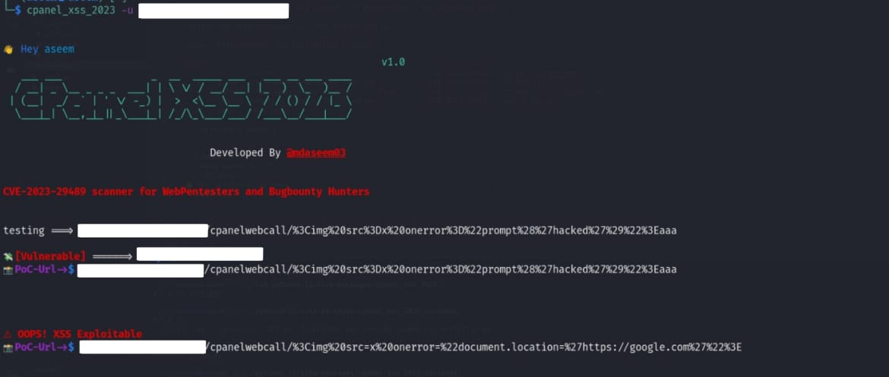

## About the Tool ⚒️

`cpanel_xss_2023` is a simple Python script designed for finding CVE-2023-29489 vulnerability and exploitability in cpanel.



## Features ⚙️

- **CVE-2023-29489 Scanning:** Identifies and scans for the CVE-2023-29489 vulnerability and exploitation.
- **URL Input:** Supports scanning a single URL or reading multiple URLs from a file.
- **Output Logging:** Allows users to write the scan results to an output file.
- **Telegram Notification:** Option to create Telegram notifications for scan results.

## Prerequisites 🧩

Before using `cpanel_xss_2023`, make sure you have the following prerequisites installed:

1. **Python 3.x**: Ensure you have Python 3.x installed on your system.

   - [Download Python](https://www.python.org/downloads/)

2. **Required Python Packages**:

   - **Click**: Install the `click` library using the following command:

     ```bash
     pip install click
     ```

   - **Requests**: Install the `requests` library using the following command:

     ```bash
     pip install requests
     ```

   - **PyYAML**: Install the `PyYAML` library using the following command:

     ```bash
     pip install PyYAML
     ```

3. **Telegram Notification (Optional)**:

   If you plan to use the Telegram notification feature, you'll need to set up a Telegram bot and obtain your chat ID. Follow these steps:

   - Create a Telegram bot using the [BotFather](https://core.telegram.org/bots#botfather).
   - Obtain your chat ID using the [get_id_bot](https://t.me/get_id_bot).
   

## Usage 🚀

```bash
cpanel_xss_2023 -u https://example.com
cpanel_xss_2023 -i urls.txt -o results.txt
cpanel_xss_2023 -u https://example.com -c your_telegram_chat_id
```

## Help Menu ❓

- `u, --url:` Specify the URL to scan for the CVE-2023-29489 vulnerability.
Example: cpanel_xss_2023 -u https://target.com

- `i, --input:` Read input URLs from a file.
Example: cpanel_xss_2023 -i target.txt

- `o, --output:` Write scan results to an output file.
Example: cpanel_xss_2023 -i target.txt -o output.txt

- `c, --chatid:` Create Telegram notifications for scan results.
Example: cpanel_xss_2023 --chatid your_telegram_chat_id

- `h, --help:` Display the help menu.

## Disclaimer ⚠️
This script is intended for educational and ethical purposes only. Unauthorized use of this script to perform malicious activities is strictly prohibited. The developers are not responsible for any misuse or damage caused by this script.

## Version History 🕒
- `v1.0`: Find CVE-2023-29489 in cpanel
- `v1.1`: Find whether the endpoint is exploitable or not


### Profile Views 👁️


## License 🪪
[](https://choosealicense.com/licenses/mit/)

## Author 👤
[@mdaseem03](https://github.com/mdaseem03)

## Connect at 💬
<a href="https://www.linkedin.com/in/mohammed-aseem%F0%9F%8E%96-11baa6217/" target="blank"></a>
<a href="https://www.instagram.com/mdaseem_03" target="blank"></a>
